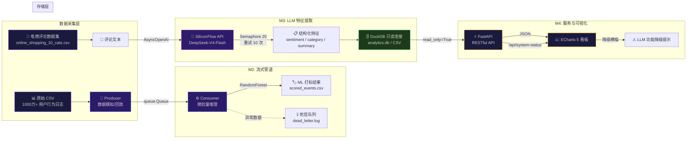

# 电商评论大数据分析看板

> 基于 **轻量级高性能数据栈 + 大语言模型 API** 的高校课程实验交付项目  
> 《大数据分析》M4 里程碑 — 系统联调与产品级交付

[](https://python.org)
[](https://fastapi.tiangolo.com)
[](https://duckdb.org)
[](https://echarts.apache.org)

---

## 📋 项目简介

本项目构建了一套完整的 **电商评论大数据分析系统**，打通了"数据流模拟 → 队列监听 → LLM 特征提取 → 数据持久化 → 后端 API → 前端可视化"的全链路。系统以千万级脱敏电商用户行为日志和中文评论数据为基础，集成了传统机器学习模型与大规模语言模型，提供实时分析看板。

### ✨ 核心技术特色

- **千万级脱敏日志极速 ETL**：基于 DuckDB / Polars 列式引擎完成千万行用户行为数据的清洗、分区与列式存储，相比 Pandas 逐行处理吞吐量提升 10×+
- **流式背压管道与 ML 实时预测**：基于 Python `queue.Queue` 构建生产者-消费者解耦管道，水位线背压控制 + 微批量推理，可配置 QPS、并发数、批次策略，异常数据自动归入死信队列
- **高并发大模型调优容错设计**：基于 SiliconFlow API (OpenAI 兼容协议) 实现异步高并发 (Semaphore) LLM 特征抽取，tenacity 指数退避重试 (最多 10 次)，正则兼容 markdown 代码围栏响应解析
- **前后端解耦的动态可视化看板**：FastAPI 提供 RESTful 数据接口，ECharts 5 实现品类/情感双向联动筛选、维度下钻、正则搜索防抖、LLM 功能降级状态透传

---

## 🏗 系统架构与数据流拓扑



### 数据流向说明

| 阶段 | 输入 | 处理 | 输出 |
|------|------|------|------|
| **数据采集** | `UserBehavior.csv` (千万级行为日志) | Producer 模拟/回放 → 队列 | 实时事件流 |
| **流式 ML 推理** | 队列中的事件 | Consumer 微批量特征工程 + RandomForest 预测 | `scored_events.csv` + 死信日志 |
| **LLM 特征抽取** | `online_shopping_10_cats.csv` (电商中文评论) | AsyncOpenAI → SiliconFlow API (20 并发, 10 次重试) | `batch_1000_features.csv` (sentiment/category/summary) |
| **数据服务** | Parquet / CSV / DB | DuckDB 只读连接 → pandas DataFrame | FastAPI JSON 响应 |
| **可视化** | API JSON | ECharts 5 渲染 → 双向联动 + 下钻 | 浏览器实时看板 |

---

## 🚀 快速开始

### 环境要求

- **Python** 3.10+
- **操作系统** Windows / Linux / macOS
- **浏览器** Chrome / Edge / Firefox（现代版本）

### 1. 克隆项目

```bash
git clone <your-repo-url>
cd test14/dashboard
```

### 2. 创建并激活虚拟环境

```bash
# Windows
python -m venv .venv
.venv\Scripts\activate

# Linux / macOS
python3 -m venv .venv
source .venv/bin/activate
```

### 3. 安装依赖

```bash
pip install -r requirements.txt
```

### 4. 配置环境变量（可选）

如需启用 LLM 特征提取功能，请配置 SiliconFlow API Key：

```bash
# Windows
set SILICONFLOW_API_KEY=sk-your-api-key-here

# Linux / macOS
export SILICONFLOW_API_KEY=sk-your-api-key-here
```

> 未配置 API Key 时，看板仍可正常运行，但大模型功能将降级为内置规则库，页面上会显示降级横幅提示。

### 5. 一键启动

```bash
python run_app.py
```

脚本将自动完成：
- ✅ 环境自检（数据文件、前端页面、端口占用）
- ✅ 启动 FastAPI 后端服务
- ✅ 轮询等待服务就绪后，自动打开浏览器
- ✅ 按 `Ctrl+C` 优雅关闭所有子进程

启动后访问：**http://127.0.0.1:8000**

### 6. 运行流式管道（可选，独立入口）

```bash
# 模拟模式：生成合成数据 + ML 实时推理
python pipeline/streaming_pipeline.py --mode simulate --qps 50 --duration 20

# 回放模式：从 CSV 流式读取
python pipeline/streaming_pipeline.py --mode replay --qps 30 --max_rows 500
```

### 7. 运行 LLM 特征提取（可选，需要 API Key）

```bash
python pipeline/llm_extractor.py --limit 500 --concurrency 20
```

---

## ⚙️ 配置说明

### 环境变量

| 变量名 | 必填 | 说明 | 默认值 |
|--------|------|------|--------|
| `SILICONFLOW_API_KEY` | 否* | 硅基流动 API Key，用于 LLM 特征提取 | - |
| `DASHBOARD_HOST` | 否 | FastAPI 绑定地址 | `127.0.0.1` |
| `DASHBOARD_PORT` | 否 | FastAPI 监听端口 | `8000` |

> \* 未配置时 LLM 功能降级，看板顶部显示黄色横幅提示

### 启动参数 (`run_app.py`)

| 参数 | 说明 | 默认值 |
|------|------|--------|
| `--port` | 服务端口 | `8000` |
| `--host` | 绑定地址 | `127.0.0.1` |
| `--no-browser` | 不自动打开浏览器 | `False` |

### 数据文件

| 文件 | 路径 | 说明 |
|------|------|------|
| LLM 增强特征数据 | `data/batch_1000_features.csv` | 优先数据源，包含 LLM 提取的 sentiment/category/summary |
| 原始评论数据 | `D:/cxdownload/online_shopping_10_cats.csv` | 回退数据源，LLM 特征数据缺失时使用 |

> 系统按 **LLM 增强数据 → 原始 CSV → 空数据集** 的优先级自动降级，不会因单个数据源缺失而崩溃。

---

## 📂 项目目录树

```
dashboard/
├── run_app.py                  # 🔧 一键启动脚本（环境自检 + 子进程管理 + 浏览器唤起）
├── server.py                   # ⚡ FastAPI 后端服务（DuckDB 只读连接 + 6 个 API 端点）
├── config.py                   # ⚙️ 统一配置中心（路径、端口、API Key、管道参数）
├── requirements.txt            # 📦 最小化依赖清单（精准版本约束）
├── README.md                   # 📖 项目文档（本文件）
├── .env.example                # 🔑 环境变量配置模板
├── .gitignore                  # 🚫 Git 忽略规则
│
├── frontend/
│   └── index.html              # 📊 ECharts 5 交互看板（双向联动 + 下钻 + 防抖 + 降级横幅）
│
├── pipeline/
│   ├── __init__.py             # 包初始化
│   ├── llm_extractor.py        # 🤖 LLM 异步高并发特征提取器（独立运行）
│   └── streaming_pipeline.py   # 🔄 流式数据管道：Producer → Queue → Consumer + ML 推理
│
└── data/
    └── batch_1000_features.csv # 📋 LLM 增强特征数据（1000 条，含 sentiment/category/summary）
```

---

## 🛡 防御性编程设计

### 1. DuckDB 只读连接

```python
conn = duckdb.connect(":memory:", read_only=True)
```

FastAPI 服务使用只读模式连接 DuckDB，避免与流式写入 Worker 产生写锁冲突（`Database Error: Could not set write lock`）。

### 2. 分级数据降级

```
LLM 增强特征数据 (batch_1000_features.csv)
    ↓ 缺失
原始评论 CSV (online_shopping_10_cats.csv)
    ↓ 缺失
空 DataFrame（不崩溃，API 返回空数组 + 友好错误提示）
```

### 3. API Key 显式降级

- **后端**：启动时检测 `SILICONFLOW_API_KEY`，未配置则控制台输出黄色警告日志
- **前端**：通过 `/api/system-status` 获取降级状态，在看板顶部显示醒目横幅

### 4. 每 API 防御性 try-except

所有 API 端点均包裹在 try-except 中，单次查询失败不会导致整个服务崩溃，返回空数据 + error 字段。

---

## 🔗 Git 仓库

- **远程仓库**：[github-repo-url](https://github.com/tone0333/bigdata)
- **Commit 规范**：遵循 [Conventional Commits](https://www.conventionalcommits.org/)
- **大文件控制**：`.gitignore` 已排除 CSV / Parquet / DB / 虚拟环境 / IDE 缓存

---

## 📝 实验依赖

本实验的完整数据流依赖前序实验产出：

| 前序实验 | 产出 | 用途 |
|----------|------|------|
| M1 (Week 1-4) | `clean_data_partitioned/` Parquet 数据 | 原始数据 ETL |
| M2 (Week 5-8) | `model.pkl` (RandomForest) | 流式管道 ML 推理 |
| M3 (Week 9-11) | `batch_1000_features.csv` | LLM 特征增强数据 |
| M4 (Week 12-13) | `server.py` + `frontend/index.html` | 看板基础代码 |

---

> **课程**：《大数据分析》 | **里程碑**：M4 数据看板与产品级交付 | **实验**：十四 · 系统联调与工程规范
